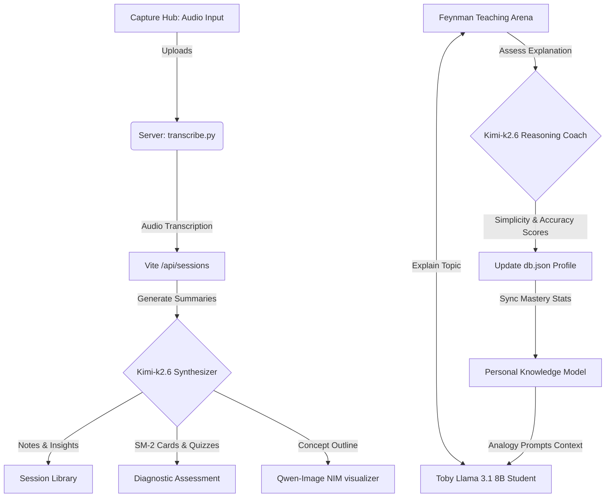

# AURA — AI Learning Companion & Socratic Feynman Arena

AURA is a state-of-the-art educational platform designed to turn passive learning into structured, long-term memory. By combining audio recording capture, automatic transcript synthesis, visual concept mapping, practice assessments, and an active **Feynman Socratic Teaching Arena**, AURA adapts to your unique learning style and continuously updates your personal knowledge profile.

---

## 🌟 Key Features

### 1. Capture Hub & Audio Transcription
- **Real-Time Voice Notes:** Record lectures, study groups, or quick voice memos directly in the browser.
- **Auto-Transcription:** Processes uploaded audio using gRPC/Python helpers to create high-fidelity text transcripts.

### 2. Session Library
- **AI-Generated Summaries:** Synthesizes transcripts into structured study notes, key takeaways, and action items.
- **SuperMemo SM-2 Flashcards:** Auto-generates study flashcards linked to your learning files. Grading card reviews adjusts spacing intervals based on memory decay algorithms.
- **Interactive Quizzes:** Dynamic multiple-choice quizzes test your conceptual understanding, complete with explanations for correct and incorrect answers.
- **Qwen NIM Concept Map:** Instantly generates black-and-white visual concept map flow diagrams representing the structure of your learning material.

### 3. Personal Knowledge Profile
- **Concept Topology:** An interactive SVG graph charting your learning landscape, grouping topics into mastered and struggling domains.
- **Drawer Deep-Dive:** Clicking any topic in your profile or Peer Sync diagram opens a details drawer containing summary notes and a direct prompt trigger to study with the AI Mentor.

### 4. Feynman Active Teaching Arena
- **Conversational Child Roleplay (Toby):** Explain complex topics to **Toby**, a virtual 10-year-old student (powered by Llama 3.1 8B). Toby references your study history and asks for custom analogies matching your strengths (e.g., explaining algorithms like a game level if you excel in gaming).
- **Socratic Grading (Kimi-k2.6):** When you request assessment, Kimi evaluates your explanation on **Simplicity** and **Accuracy**, identifies conceptual gaps, updates your mastery levels, and logs your progress in your knowledge profile's Recent Activity feed.

---

## 📐 System Architecture & Flow



---

## 🛠️ Technology Stack
- **Frontend:** React.js, TailwindCSS, Lucide Icons
- **Math Rendering:** KaTeX Integration (LaTeX equations)
- **Backend:** Node.js, Express, Multer
- **Database:** Local JSON-based caching (`db.json`)
- **API Orchestration:** NVIDIA NIM API (Llama 3.1 8B, Kimi-k2.6, Qwen-Image-2.5)

---

## 🚀 Getting Started

### 1. Prerequisites
- Node.js (v18 or higher)
- Python 3 (with `grpcio` and other transcription dependencies configured)

### 2. Installation
Clone the repository:
```bash
git clone https://github.com/wavesiddhartha/aura.git
cd aura
```

Install server and client dependencies:
```bash
npm install
```

### 3. Environment Configuration
Create a `.env` file in the root directory:
```env
PORT=3001
NVIDIA_KIMI_KEY=your_nvidia_nim_kimi_api_key
NVIDIA_QWEN_KEY=your_nvidia_nim_qwen_api_key
```

### 4. Run the Project
Start both the API backend server and the Vite frontend dev server:
```bash
# Start backend server
npm run server

# Start Vite frontend
npm run dev
```

Open `http://localhost:5173` in your browser.

---

## 📄 License
This project is open-source and available under the MIT License.